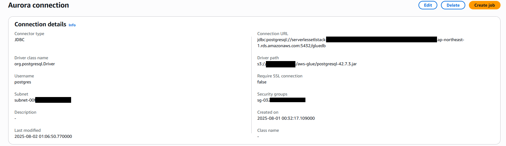
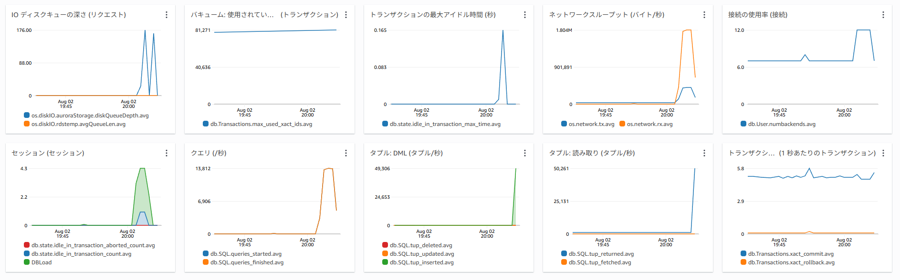

# serverless-postgre-demo## GlueとAurora(PostgreSQL)を繋ぐ手順

1. **Glue Databaseの作成**  
   - まずは枠だけ作成（中身は後でCrawlerで作成）

2. **Glue Connectionの作成**  
   - タイプ: JDBC  
   - 接続先: Aurora PostgreSQLのエンドポイント  
   - JDBC URL例: `jdbc:postgresql://<aurora-endpoint>:5432/<dbname>`  
   - ユーザー名・パスワード・VPC・サブネット・セキュリティグループを指定
   - Postgreのドライバは自分でDLしてS3にアップロード。ドライバのS3にアクセスできる権限とかも追加。

3. **Glue-Aurora間の通信許可**  
   - Glueのセキュリティグループ（SG）のインバウンドに「AuroraのSG」をソースとした全ての通信を許可  
   - GlueのSGのアウトバウンドは `0.0.0.0/0` でOK  
   - AuroraのSGのインバウンドに「GlueのSG」からの通信を許可

4. **Glue-S3間の通信許可**  
   - S3エンドポイント（VPCエンドポイント）を作成  
   - Glueが利用するサブネットのルートテーブルにS3エンドポイントを追加

5. **Glue Crawlerの作成**  
   - 作成したConnectionを指定  
   - Glue Databaseを指定  
   - Crawler実行でスキーマを自動作成

6. **IAMロールの設定**  
   - GlueServiceRole（Glue用のマネージドポリシー）  
   - SecretsManager（Auroraの認証情報をSecretで管理する場合はアクセス権限も付与）

AuroraのDBの中身をGlueのDatabaseに反映させるCrawlerは何度やってもInternal Server Errorが出てしまうため、諦めました。

下記の通りに実行
https://stackoverflow.com/questions/76901396/failed-to-connect-amazon-rds-in-aws-glue-data-catalogs-connection

https://docs.aws.amazon.com/ja_jp/glue/latest/dg/define-crawler-choose-data-sources.html

3000万件のcsvを入れるとき、JDBC接続の場合、秒間1万件のクエリが発生していたので、たぶん1行ずつINSERTしている。
分散でファイル出力、COPYする方法を考えたほうが良いかも。

## S3インポート機能を使うための準備

参考 https://docs.aws.amazon.com/ja_jp/AmazonRDS/latest/AuroraUserGuide/USER_PostgreSQL.S3Import.html

これに加えて、S3バケットポリシーの設定と、Auroraのセキュリティグループのアウトバウンドに0.0.0.0/0を許可しました。

## S3 To Auroraするとしたら
1. S3でファイル名かフォルダを受け取る。
2. データ型を変換する
3. S3に一回書き出す
4. table_import_from_s3でS3から直接COPYする

